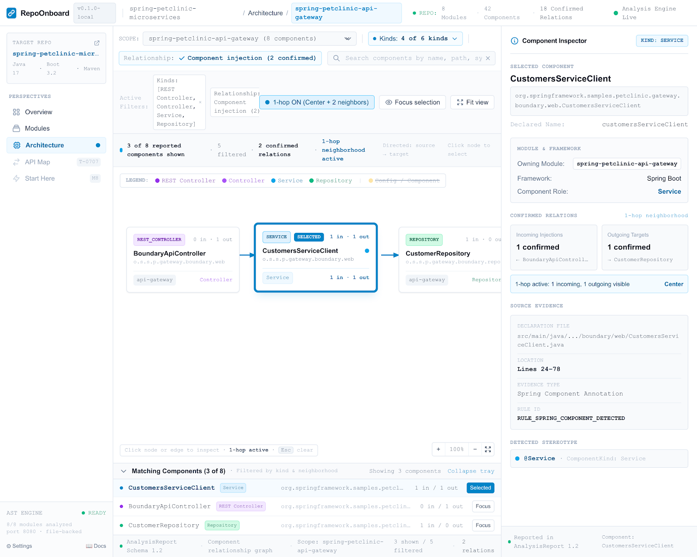

# RepoOnboard

**English** | [简体中文](./README.zh-CN.md)

> Turn an unfamiliar Java, Maven, and Spring Boot repository into a traceable local codebase map.

RepoOnboard is a local-first codebase comprehension and developer onboarding tool. It statically analyzes a repository, keeps the source evidence behind important findings, and presents the result in a read-only Web UI before you start changing code.

> **Status: V0.1.0 released**
>
> Download the verified archive from the [V0.1.0 GitHub Release](https://github.com/zhan-cm/RepoOnboard/releases/tag/v0.1.0). RepoOnboard is licensed under the Apache License 2.0; bundled third-party components remain under their respective licenses.
>
> The verified V0.1.0 archive remains the current release. The `master` branch now contains a post-release workbench and Architecture visual refresh that is not included in that archive and has not yet been published as a new release.

## Current UI and V0.1.0 release demo

### Current `master` UI direction



The checked-in Stitch handoff above is the visual reference implemented by the post-release workbench and Architecture card refresh on current `master`. It is a design artifact, not a runtime capture or release-validation record; its repository name, counts, status, and component data are illustrative. The application continues to render only facts from the analyzed report.

### Verified V0.1.0 release demo

The V0.1 public demo target is [`jhipster/jhipster-sample-app`](https://github.com/jhipster/jhipster-sample-app) at fixed commit [`e06e87abe0be8a3a194381ce651164a734811b3f`](https://github.com/jhipster/jhipster-sample-app/commit/e06e87abe0be8a3a194381ce651164a734811b3f). That revision contains an [Apache License 2.0 file](https://github.com/jhipster/jhipster-sample-app/blob/e06e87abe0be8a3a194381ce651164a734811b3f/LICENSE.txt) and is analyzed without modifying, building, or running the third-party source.


The 14.4-second GIF records the published V0.1.0-era UI and fixed demo input; it is retained as release evidence rather than presented as the current `master` interface. It keeps `PARTIAL` visible and condenses the verified run rather than claiming a 14.4-second scan. See the [capture record](./docs/demo/V0.1-DEMO-MEDIA.md) for exact hashes and scene evidence.

See the [V0.1 Demo Repository guide](./docs/demo/V0.1-DEMO.md) for the exact checkout, empty-cache analysis command, expected release counts, limitations, and four-page walkthrough. The immutable V0.1.0 release evidence contains one module, 81 source files, 30 components, 24 endpoints, 7 confirmed component edges, and 24 Start Here items. Current `master` after M12 reports 33 components, 38 endpoints and 14 confirmed component edges for the same commit; the source-backed delta is documented in the [M12 revalidation](./docs/validation/T-1203-ACCURACY-REVALIDATION.md). Both runs remain transparently `PARTIAL` because unrelated Maven and external-target limitations remain.

For a faster synthetic smoke test, first [build from source](#install-from-source), then run the repository's [small deterministic Spring fixture](./src/test/resources/fixtures/spring-analysis-project):

Windows PowerShell:

```powershell
.\repoonboard.cmd .\src\test\resources\fixtures\spring-analysis-project --no-open
```

macOS or Linux:

```bash
./repoonboard ./src/test/resources/fixtures/spring-analysis-project --no-open
```

Open the printed `http://127.0.0.1:<port>/` address and stop the process with Ctrl+C. These fixture commands use the current `target/repoonboard.jar` source-build artifact because the test fixture is not included in the release archive.

## Install the V0.1.0 release

### Requirements

The packaged release only requires Java 21 or newer. It does not require Maven,
Node.js, or Git.

Download `repoonboard-0.1.0.zip` and `repoonboard-0.1.0.zip.sha256` from the
[V0.1.0 release](https://github.com/zhan-cm/RepoOnboard/releases/tag/v0.1.0).

Windows PowerShell:

```powershell
$expectedHash = (Get-Content .\repoonboard-0.1.0.zip.sha256).Split()[0]
$actualHash = (Get-FileHash .\repoonboard-0.1.0.zip -Algorithm SHA256).Hash.ToLowerInvariant()
if ($actualHash -ne $expectedHash) { throw "RepoOnboard checksum mismatch" }
Expand-Archive .\repoonboard-0.1.0.zip -DestinationPath .
cd .\repoonboard-0.1.0
.\repoonboard.cmd --version
.\repoonboard.cmd C:\path\to\spring-project
```

Linux:

```bash
sha256sum -c repoonboard-0.1.0.zip.sha256
unzip repoonboard-0.1.0.zip
cd repoonboard-0.1.0
./repoonboard --version
./repoonboard /path/to/spring-project
```

macOS:

```bash
shasum -a 256 -c repoonboard-0.1.0.zip.sha256
unzip repoonboard-0.1.0.zip
cd repoonboard-0.1.0
./repoonboard --version
./repoonboard /path/to/spring-project
```

The archive includes `repoonboard.jar`, both launchers, the JAR checksum, both
README files, `LICENSE`, `NOTICE`, `THIRD_PARTY_NOTICES.md`, and all distributed
third-party license texts.

## Install from source

### Requirements

| Requirement | Needed to run | Needed to build from source |
| --- | --- | --- |
| Java | Java 21 or newer | JDK 21 or newer |
| Node.js | No | `^20.19.0` or `>=22.12.0` |
| Maven | No | No separate install; the Wrapper supplies Maven 3.9.16 |
| Git | No | Yes, for the commands below |

A clean machine needs network access for the initial clone and for the Wrapper to download Maven plus the locked Java and frontend build dependencies. An analyzed repository is not built or executed, and core repository analysis does not fetch its POMs or artifacts from remote repositories.

Check the required tools:

```text
java -version
node --version
git --version
```

> **Current `master` build note:** the post-release UI refresh remains unreleased, but its production resources are local again and the full `clean verify` gate passes. V0.1.0 remains the current published archive until a separately versioned release passes the cross-platform workflow.

Windows PowerShell:

```powershell
git clone https://github.com/zhan-cm/RepoOnboard.git
cd RepoOnboard
.\mvnw.cmd clean verify
.\repoonboard.cmd --help
```

macOS or Linux:

```bash
git clone https://github.com/zhan-cm/RepoOnboard.git
cd RepoOnboard
./mvnw clean verify
chmod +x repoonboard
./repoonboard --help
```

The verified build produces:

```text
target/repoonboard.jar
target/repoonboard.jar.sha256
```

The executable JAR contains the Java runtime dependencies and complete offline Web UI. The launchers use `repoonboard.jar` beside the script in the extracted release, or `target/repoonboard.jar` in a source checkout. Set `REPOONBOARD_JAR` only to select an explicit alternate JAR.

Verify the checksum before running a copied or downloaded JAR.

Windows PowerShell:

```powershell
$expectedHash = (Get-Content .\target\repoonboard.jar.sha256).Split()[0]
$actualHash = (Get-FileHash .\target\repoonboard.jar -Algorithm SHA256).Hash.ToLowerInvariant()
if ($actualHash -ne $expectedHash) { throw "RepoOnboard checksum mismatch" }
```

Linux:

```bash
(cd target && sha256sum -c repoonboard.jar.sha256)
```

macOS:

```bash
(cd target && shasum -a 256 -c repoonboard.jar.sha256)
```

## Usage

```text
repoonboard [OPTIONS] PATH
```

`PATH` must be the root of a supported Maven Spring Boot repository and contain its root `pom.xml`.

| Option | Meaning |
| --- | --- |
| `--no-open` | Start the local UI without opening the default browser. |
| `--profile ID[,ID...]` | Activate explicit Maven profile IDs; the option is repeatable. |
| `--local-repository PATH` | Read permitted external parent/BOM POMs from this local Maven cache. Defaults to `~/.m2/repository`. |
| `-h`, `--help` | Show command help. |
| `-V`, `--version` | Show the RepoOnboard version. |

Examples:

```bash
repoonboard /path/to/project
repoonboard . --no-open
repoonboard . --profile dev,local --local-repository /path/to/local/maven/repository
```

After analysis, RepoOnboard starts a read-only UI on a system-assigned `127.0.0.1` port. The process and UI remain available until Ctrl+C. The service accepts only its exact loopback Host and same-origin browser requests; it exposes fixed read-only routes and does not provide arbitrary file access.

### Exit codes and partial analysis

| Exit code | Meaning |
| ---: | --- |
| `0` | Analysis completed successfully. |
| `1` | Analysis failed, or the project is unsupported. |
| `2` | Command arguments are invalid. |
| `3` | Analysis is partial; confirmed facts were preserved, but coverage is incomplete. |

A missing local parent/BOM, invalid Java file, unresolved type, or unsupported pattern can produce `PARTIAL`. Review the warning code, module, repository-relative source location, and suggested action before relying on totals. CLI and UI diagnostics use the same report severity, code, stage, message, module, and source facts.

A directory without a root `pom.xml`, or a complete Maven model without recognized Spring Boot build evidence, is unsupported in V0.1 and returns `1`. When incomplete Maven data prevents Spring Boot confirmation, RepoOnboard conservatively returns `3` rather than claiming either support or failure as a fact.

## Current features

Current `master` keeps the V0.1 analysis and report contracts while introducing a denser, IDE-style workbench shell, repository and module context in navigation, a light/dark theme control, and richer Architecture component cards. The cards expose component role, package/module context, and confirmed incoming/outgoing relationship counts without changing the underlying evidence model. Post-release hardening now keeps theme preference across system-assigned loopback ports, refreshes graph colors with the active theme, uses theme-aware Architecture status surfaces, and lays out the six primary Overview metrics as a complete desktop row. These visual changes are post-release source work, not V0.1.0 release contents.

- **Repository Overview** — project identity, reported technology versions, modules, source roots, component/API counts, application entry points, and coverage status.
- **Module Explorer** — Maven aggregation hierarchy, metadata, source roots, exact-coordinate internal module dependencies, components, diagnostics, and evidence.
- **Architecture Workspace** — module-scoped confirmed Spring component-injection relationships, searchable card-based graph, component role/package/module context, confirmed in/out counts, filters, one-hop focus, graph/list fallback, source evidence, and unresolved counts.
- **API Map** — Spring MVC method/path/handler facts, module/method/text filters, mapping conditions, unresolved states, and both method- and class-level evidence.
- **Source & Evidence Detail** — repository-relative path, real 1-based location, symbol, module, evidence, and exactly joined related facts; it does not expose source text or pretend to open an IDE.
- **Start Here** — deterministic file reading order with visible reasons based on build files, entry points, configuration, public APIs, and confirmed dependencies.
- **Failure-tolerant reports** — stable report IDs and schema `1.2`, explicit `SUCCESS`/`PARTIAL`/`FAILED` status, actionable diagnostics, and preservation of confirmed facts after local failures.

The published V0.1.0 UI and current `master` package all production resources in the JAR and use no runtime CDN. The post-release visual changes on `master` remain unreleased. RepoOnboard V0.1 does not use an LLM, upload repository contents, run the target application, execute Maven lifecycle/plugins/extensions, or modify analyzed source files.

## Supported stack

| Area | V0.1 support |
| --- | --- |
| Target language | Java source, including tested Java 8/11/17/21 syntax fixtures |
| Build system | Maven, including single/multi-module projects, explicit and `activeByDefault` profiles, relative parents, and local-cache parent/BOM POMs |
| Framework | Spring Boot build signals, common stereotype/configuration/application annotations, constructor/field injection facts, and Spring MVC mappings |
| RepoOnboard runtime | Java 21 or newer |
| Interface | Local read-only Web UI |
| Report | UTF-8 JSON schema `1.2`; readers retain compatibility with `1.0` and `1.1` |

Maven model resolution is intentionally restricted. Relative parents must stay inside the scan root; external parent/BOM POMs may only come from the selected local repository. RepoOnboard does not use Maven settings, implicit host OS/JDK/file/property profile activation, remote resolution, transitive dependency calculation, or BOM property inheritance.

Spring Boot detection uses a declared `spring-boot-starter-parent`, an imported `spring-boot-dependencies` BOM, or resolved/inherited Boot core or starter dependencies. A build signal does not prove that an application entry point exists.

## Known limitations

- V0.1 supports only Java + Maven + Spring Boot. Gradle and other languages/frameworks are not supported.
- Type resolution is limited to uniquely confirmed project-local declarations. Runtime wiring, reflection, generated registrations, proxies, and a full method-level call graph are outside V0.1.
- MyBatis/MyBatis-Plus Mapper-specific classification is deferred.
- M12 recognizes interfaces that directly inherit a conservative set of well-known Spring Data core/JPA repository bases. Arbitrary project-local intermediate repository hierarchies and unlisted store-specific bases are not inferred from an unavailable external classpath.
- With multiple wildcard imports, a Spring annotation is confirmed only when exactly one known Spring qualified-name candidate matches. Explicit conflicts or multiple known candidates remain ambiguous.
- The Architecture graph stops drawing when the filtered scope exceeds 60 components or 120 confirmed edges, but a graph inside that budget can still be semantically dense. The component list remains available.
- API rows and diagnostics are not virtualized or paginated. The ThingsBoard boundary trial completed 3,834 main Java files but observed 648.23 MiB peak process memory, 1,719 diagnostics, 581 API rows, ambiguous duplicate module labels, and graphs that could remain unreadable. RepoOnboard does **not** claim complete support for repositories of that scale.
- At a 1280 px viewport, medium-repository Architecture labels may clip and the API source column may require horizontal scrolling.
- First-contact validation showed that API lookup was easiest and Start Here could locate its first three files, but module, entry-point, dependency, and recommendation explanations still caused confusion. The 5–10 minute observation had no manual-reading control group, so V0.1 does not claim a measured speed-up over manual exploration.

## Validation evidence

- [V0.1 demo GIF capture record](./docs/demo/V0.1-DEMO-MEDIA.md)
- [V0.1 fixed public demo repository and walkthrough](./docs/demo/V0.1-DEMO.md)
- [Minimal deterministic Spring regression fixture](./src/test/resources/fixtures/spring-analysis-project)
- [Small repository: Spring Petclinic](./docs/validation/T-0904-SPRING-PETCLINIC.md)
- [Medium repository: JHipster Sample Application](./docs/validation/T-0905-JHIPSTER-SAMPLE-APP.md)
- [V0.2 M12 accuracy revalidation](./docs/validation/T-1203-ACCURACY-REVALIDATION.md)
- [Large boundary trial: ThingsBoard](./docs/validation/T-0906-THINGSBOARD-LARGE-TRIAL.md)
- [First-contact onboarding observation](./docs/validation/T-0907-ONBOARDING-VALUE.md)
- [Windows/macOS/Linux release gate](https://github.com/zhan-cm/RepoOnboard/actions/workflows/release.yml)

`./mvnw clean verify` runs the Java and frontend suites, builds the production UI, packages the executable JAR, starts that JAR against the controlled Spring fixture with an empty Maven cache, checks the report route, and writes the checksum. It does not build or execute the fixture application.

## Roadmap

M0–M10 and the V0.1.0 public release are complete. M11 has now frozen the V0.2 scope as **Accuracy & Accessible Local Experience**; the active milestone plan and gates are recorded in [TODO.md](./TODO.md). V0.1.0 remains the current release while V0.2 is in development.

V0.2 stays on Java + Maven + Spring Boot and keeps the local-first, deterministic, explainable analysis boundary. M12 has closed the confirmed Spring Data repository-inheritance and multi-wildcard annotation-resolution gaps against controlled and fixed real repositories. M13 is next and starts with a product-copy/data-boundary audit plus a Settings Data Contract and Stitch handoff; implementation waits for the user-reviewed design. The selective English/中文 switch may translate product navigation, explanations, states, empty results, and errors, while code identifiers, paths, class names, APIs, framework terms, and original Evidence remain unchanged.

M14 evaluates `jpackage` and Tauri 2 using package size, startup, memory, offline behavior, runtime, process lifecycle, installer, security, and signing evidence. Desktop delivery is conditional on a new accepted ADR; if no option meets the acceptance gate, V0.2 still ships through the existing Web-first executable JAR and Windows/POSIX launchers.

## Contributing

Before proposing a change, read [PROJECT.md](./PROJECT.md), [DECISIONS.md](./DECISIONS.md), [TODO.md](./TODO.md), and [AGENTS.md](./AGENTS.md). Keep changes focused on an accepted task, add the narrowest sufficient test, preserve source evidence, and do not expand the supported ecosystem without an explicit scope decision.

Unless explicitly stated otherwise, contributions intentionally submitted for inclusion in RepoOnboard are accepted under the Apache License 2.0, consistent with section 5 of that license. Use a GitHub issue to discuss substantial proposed changes before submitting code.

## License

RepoOnboard is licensed under the [Apache License 2.0](./LICENSE), Copyright 2026 zhan-cm. The license grants permissions subject to its stated conditions and includes an express patent license; it does not provide a warranty.

The executable JAR and production Web UI include components under Apache-2.0, EPL-2.0, MIT, BSD-2-Clause, BSD-3-Clause, and ISC terms. See [THIRD_PARTY_NOTICES.md](./THIRD_PARTY_NOTICES.md) for the audited component versions, attributions, license choices, source references, and included license texts.

## Project philosophy

> **Understand first. Modify later.**
>
> **Static analysis before generative AI.**
>
> **Accurate before impressive.**
>
> **One ecosystem done well before many ecosystems done poorly.**
