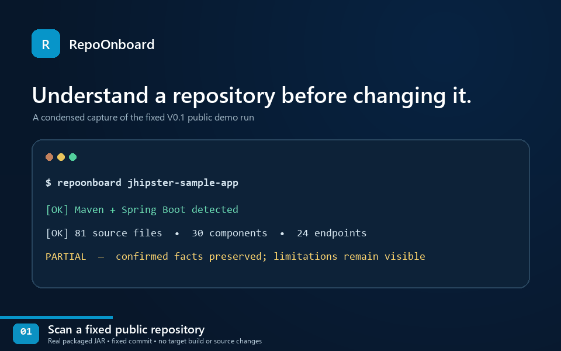

# RepoOnboard

[English](./README.md) | **简体中文**

> 将陌生的 Java、Maven、Spring Boot 仓库转化为可追溯的本地代码库地图。

RepoOnboard 是一个本地优先的代码库理解与开发者上手工具。它通过静态分析仓库、保留重要结论背后的源码证据，并在你开始修改代码前把结果呈现在只读 Web UI 中。

> **状态：发布前（`0.1.0-SNAPSHOT`）**
>
> 当前实现处于发布准备阶段，尚无可下载的 V0.1 Release 或 release tag，请使用下方源码构建步骤。源码目前公开可见，但尚未选择 License，因此不能在法律意义上称为开源，也不能默认获得复用授权。

## 演示

V0.1 公开 Demo 目标是固定 commit [`e06e87abe0be8a3a194381ce651164a734811b3f`](https://github.com/jhipster/jhipster-sample-app/commit/e06e87abe0be8a3a194381ce651164a734811b3f) 的 [`jhipster/jhipster-sample-app`](https://github.com/jhipster/jhipster-sample-app)。该 revision 包含 [Apache License 2.0 文件](https://github.com/jhipster/jhipster-sample-app/blob/e06e87abe0be8a3a194381ce651164a734811b3f/LICENSE.txt)；RepoOnboard 不修改、不构建、也不运行第三方源码。



这段 14.4 秒 GIF 使用当前 V0.1 打包候选和固定 Demo 输入，全程保留 `PARTIAL`；它压缩展示已验证的运行过程，不宣称扫描只需 14.4 秒。精确哈希和画面证据见[录制记录](./docs/demo/V0.1-DEMO-MEDIA.md)。

完整的固定 checkout、空缓存分析命令、预期计数、限制和四页面演示路径见 [V0.1 Demo Repository 指南](./docs/demo/V0.1-DEMO.md)。固定运行会如实产生 `PARTIAL` 报告：1 个 module、81 个 source file、30 个 component、24 个 endpoint、7 条 confirmed component edge 和 24 项 Start Here。Partial 状态和已知 wildcard-import 漏报属于演示内容，不会被隐藏。

如需更快的合成 smoke test，先[从源码构建](#从源码安装)，再运行仓库内的[小型确定性 Spring fixture](./src/test/resources/fixtures/spring-analysis-project)：

Windows PowerShell：

```powershell
.\repoonboard.cmd .\src\test\resources\fixtures\spring-analysis-project --no-open
```

macOS 或 Linux：

```bash
./repoonboard ./src/test/resources/fixtures/spring-analysis-project --no-open
```

打开终端打印的 `http://127.0.0.1:<port>/` 地址，使用 Ctrl+C 停止进程。两种路径均使用当前源码构建生成的 `target/repoonboard.jar`，不会指向尚不存在的发布压缩包。

## 从源码安装

### 环境要求

| 环境 | 仅运行 | 从源码构建 |
| --- | --- | --- |
| Java | Java 21 或更高版本 | JDK 21 或更高版本 |
| Node.js | 不需要 | `^20.19.0` 或 `>=22.12.0` |
| Maven | 不需要 | 不需单独安装；Wrapper 提供 Maven 3.9.16 |
| Git | 不需要 | 下方命令需要 |

干净环境首次构建需要联网克隆仓库，并由 Wrapper 下载 Maven、锁定的 Java 依赖和前端构建依赖。RepoOnboard 不会构建或执行被分析仓库，核心仓库分析也不会从远端下载目标项目的 POM 或构件。

先检查所需工具：

```text
java -version
node --version
git --version
```

Windows PowerShell：

```powershell
git clone https://github.com/zhan-cm/RepoOnboard.git
cd RepoOnboard
.\mvnw.cmd clean verify
.\repoonboard.cmd --help
```

macOS 或 Linux：

```bash
git clone https://github.com/zhan-cm/RepoOnboard.git
cd RepoOnboard
./mvnw clean verify
chmod +x repoonboard
./repoonboard --help
```

验证后的构建会生成：

```text
target/repoonboard.jar
target/repoonboard.jar.sha256
```

可执行 JAR 包含 Java 运行依赖和完整离线 Web UI。未来发布目录中的启动脚本会使用同目录的 `repoonboard.jar`；源码 checkout 中会使用 `target/repoonboard.jar`。只有需要显式选择其他 JAR 时才设置 `REPOONBOARD_JAR`。

运行复制或下载的 JAR 前应校验 SHA-256。

Windows PowerShell：

```powershell
$expectedHash = (Get-Content .\target\repoonboard.jar.sha256).Split()[0]
$actualHash = (Get-FileHash .\target\repoonboard.jar -Algorithm SHA256).Hash.ToLowerInvariant()
if ($actualHash -ne $expectedHash) { throw "RepoOnboard checksum mismatch" }
```

Linux：

```bash
(cd target && sha256sum -c repoonboard.jar.sha256)
```

macOS：

```bash
(cd target && shasum -a 256 -c repoonboard.jar.sha256)
```

## 使用方式

```text
repoonboard [OPTIONS] PATH
```

`PATH` 必须是受支持的 Maven Spring Boot 仓库根目录，并包含根 `pom.xml`。

| 选项 | 含义 |
| --- | --- |
| `--no-open` | 启动本地 UI，但不自动打开默认浏览器。 |
| `--profile ID[,ID...]` | 激活明确指定的 Maven profile ID；该选项可重复。 |
| `--local-repository PATH` | 从指定本地 Maven 缓存读取允许的外部 parent/BOM POM；默认 `~/.m2/repository`。 |
| `-h`、`--help` | 显示命令帮助。 |
| `-V`、`--version` | 显示 RepoOnboard 版本。 |

示例：

```bash
repoonboard /path/to/project
repoonboard . --no-open
repoonboard . --profile dev,local --local-repository /path/to/local/maven/repository
```

分析完成后，RepoOnboard 会在系统分配的 `127.0.0.1` 端口启动只读 UI。进程与 UI 保持可用，直到按下 Ctrl+C。服务只接受精确 loopback Host 和同源浏览器请求，仅暴露固定只读路由，不提供任意文件访问。

### 退出码与部分分析

| 退出码 | 含义 |
| ---: | --- |
| `0` | 分析成功完成。 |
| `1` | 分析失败，或项目不受支持。 |
| `2` | 命令参数无效。 |
| `3` | 部分成功；已确认 facts 被保留，但覆盖不完整。 |

缺少本地 parent/BOM、无效 Java 文件、未解析类型或不支持的模式可能产生 `PARTIAL`。在依赖统计结果前，应查看 warning code、module、仓库相对 source location 和建议操作。CLI 与 UI 使用相同的报告 severity、code、stage、message、module 和 source facts。

没有根 `pom.xml` 的目录，或 Maven model 完整但没有识别到 Spring Boot 构建证据的项目，在 V0.1 中不受支持并返回 `1`。如果 Maven 数据不完整导致无法确认 Spring Boot，RepoOnboard 会保守返回 `3`，不会把“支持”或“失败”冒充为已确认事实。

## 当前功能

- **Repository Overview**——项目身份、已报告技术版本、模块、源码根、组件/API 统计、应用入口和覆盖状态。
- **Module Explorer**——Maven 聚合层级、元数据、源码根、精确坐标确认的内部模块依赖、组件、诊断和 Evidence。
- **Architecture Workspace**——按模块展示确认的 Spring 组件注入关系，支持筛选、搜索、一阶邻域聚焦、图/列表回退、源码 Evidence 和 unresolved 计数。
- **API Map**——Spring MVC method/path/handler facts、模块/method/文本筛选、mapping conditions、未解析状态，以及方法级和类级 Evidence。
- **Source & Evidence Detail**——仓库相对路径、真实 1-based 位置、symbol、module、Evidence 和精确连接的相关 facts；不会展示源码正文或假装打开 IDE。
- **Start Here**——依据构建文件、应用入口、配置、公开 API 和确认依赖生成确定性文件阅读顺序，并直接展示推荐原因。
- **容错报告**——稳定报告 ID 和 schema `1.2`、明确的 `SUCCESS`/`PARTIAL`/`FAILED`、可操作 Diagnostic，以及局部失败后的确认 facts 保留。

所有生产 UI 资源均随 JAR 提供，运行时不使用 CDN。RepoOnboard V0.1 不使用 LLM、不上传仓库内容、不运行目标应用、不执行 Maven lifecycle/plugin/extension，也不修改被分析源码。

## 支持范围

| 领域 | V0.1 支持 |
| --- | --- |
| 目标语言 | Java 源码；已用 Java 8/11/17/21 语法 fixture 验证 |
| 构建系统 | Maven；包括单/多模块、显式与 `activeByDefault` profile、相对 parent、本地缓存 parent/BOM POM |
| 框架 | Spring Boot 构建信号、常见 stereotype/configuration/application 注解、构造器/字段注入 facts、Spring MVC mapping |
| RepoOnboard 运行时 | Java 21 或更高版本 |
| 界面 | 本地只读 Web UI |
| 报告 | UTF-8 JSON schema `1.2`；读取端继续兼容 `1.0` 和 `1.1` |

Maven model 解析受到有意限制：相对 parent 必须位于扫描根内；外部 parent/BOM POM 只能来自所选本地仓库。RepoOnboard 不使用 Maven settings，不采用宿主 OS/JDK/文件/属性隐式 profile 激活，不做远端解析、传递依赖计算或 BOM 属性继承。

Spring Boot 检测使用声明的 `spring-boot-starter-parent`、导入的 `spring-boot-dependencies` BOM，或已解析/继承的 Boot core/starter 依赖。构建信号不能证明应用入口一定存在。

## 已知限制

- V0.1 只支持 Java + Maven + Spring Boot，不支持 Gradle 和其他语言/框架。
- 类型解析仅覆盖唯一确认的项目内声明。运行时装配、反射、生成式注册、代理和完整方法级调用图不属于 V0.1。
- MyBatis/MyBatis-Plus Mapper 专用分类仍延后。
- 仅继承 Spring Data repository 基类且没有直接 `@Repository` 的接口目前会漏报。固定 Petclinic 验证中因此缺少 3 个 Repository 组件，并使后续 6 条注入关系保持 unresolved。
- 多个 wildcard import 可能使已知 Spring 注解被保守判为 ambiguous。固定 JHipster 验证中因此漏报 3 个 Controller、13 个 Endpoint 和 7 条确认依赖，而没有补造事实。
- 筛选范围超过 60 个组件或 120 条确认边时，Architecture 会停止绘图；但预算内图仍可能在语义上过密。组件列表始终可用。
- API row 与 Diagnostic 尚未虚拟化或分页。ThingsBoard 边界试验完成了 3,834 个 main Java file，但观察到 648.23 MiB 进程峰值、1,719 条诊断、581 个 API row、重复模块名歧义和仍可能不可读的图。RepoOnboard **不宣称完整支持**同等规模仓库。
- 在 1280 px 视口下，中型仓库 Architecture 外侧标签可能裁切，API source 列可能需要横向滚动。
- 首次接触验证中，API 定位最容易，Start Here 可以找到前三个文件，但 module、entry point、dependency 和推荐解释仍让参与者困惑。这次 5–10 分钟观察没有手工阅读对照组，因此 V0.1 不宣称相对手工探索有量化提速。
- 原生 macOS/Linux 发布 smoke check 尚未完成。目前 POSIX 启动器只在 Git Bash 中实际执行，不能据此宣称完整原生平台认证。

## 验证证据

- [V0.1 Demo GIF 录制记录](./docs/demo/V0.1-DEMO-MEDIA.md)
- [V0.1 固定公开 Demo 仓库与演示路径](./docs/demo/V0.1-DEMO.md)
- [最小确定性 Spring 回归 fixture](./src/test/resources/fixtures/spring-analysis-project)
- [小型仓库：Spring Petclinic](./docs/validation/T-0904-SPRING-PETCLINIC.md)
- [中型仓库：JHipster Sample Application](./docs/validation/T-0905-JHIPSTER-SAMPLE-APP.md)
- [大型边界试验：ThingsBoard](./docs/validation/T-0906-THINGSBOARD-LARGE-TRIAL.md)
- [首次接触上手观察](./docs/validation/T-0907-ONBOARDING-VALUE.md)

`./mvnw clean verify` 会运行 Java 和前端测试、构建生产 UI、打包可执行 JAR、使用空 Maven 缓存从该 JAR 启动受控 Spring fixture、检查报告路由并写出校验和；它不会构建或执行 fixture 应用。

## 路线图

M0–M9 以及发布准备中的打包、错误体验、README、固定公开 Demo 目标和演示媒体已完成。M10 仍包括 License、GitHub 展示清理、原生跨平台 smoke check 和正式 V0.1 Release。任务级事实以 [TODO.md](./TODO.md) 为准。

V0.1 继续采用 Web-first，发布物将是可执行 JAR 与 Windows/POSIX 启动脚本。原生桌面容器、安装器、自带 Java Runtime 和选择性的 English/中文产品界面切换属于 V0.2 候选，不进入 V0.1。界面切换只翻译产品导航、说明、状态、空结果和错误提示，代码标识符、路径、类名、API、框架术语和原始 Evidence 保持原文。

## 参与贡献

RepoOnboard 仍处于发布前开发阶段。提出变更前请阅读 [PROJECT.md](./PROJECT.md)、[DECISIONS.md](./DECISIONS.md)、[TODO.md](./TODO.md) 和 [AGENTS.md](./AGENTS.md)。变更应聚焦已接受任务，补充最窄且充分的测试，保留源码 Evidence，并且不得在没有明确范围决策时扩大 V0.1 技术生态。

由于仓库尚无 License，外部贡献和复用条款还未确定。贡献指南与 License 属于发布准备工作；在此之前，请先通过 GitHub issue 讨论提案，再提交代码。

## License

项目尚未选择 License。源码公开可见不等于获得复制、修改或再分发授权；V0.1 发布前必须完成 License 选择。

## 项目理念

> **先理解，再修改。**
>
> **静态分析优先于生成式 AI。**
>
> **准确优先于炫酷。**
>
> **先把一个技术生态做好，再扩展到更多生态。**
